<h1 align="center">Hi, I'm Yousef Farahbakhsh 👋</h1>

 

  <strong>Full-Stack Developer</strong> • React • Next.js • MERN • React Native

  I build modern, responsive, and scalable web &amp; mobile applications 
  with a focus on clean UI, performance, and great user experiences.

  <a href="https://yousef-fhb.ir">🌐 Portfolio</a>
  &nbsp;•&nbsp;
  <a href="https://github.com/yousefFHB">💻 GitHub</a>
  &nbsp;•&nbsp;
  <a href="https://www.linkedin.com/">💼 LinkedIn</a>

---

## 🧑‍💻 About Me

I'm a **Full-Stack MERN Developer** passionate about turning ideas into polished, production-oriented applications.

I enjoy working across the entire development lifecycle — from designing interactive interfaces to building secure APIs, database architectures, authentication systems, and scalable backend services.

* ⚛️ Frontend development with **React, Next.js & TypeScript**
* 🎨 Modern UI with **Tailwind CSS, MUI, GSAP & Three.js**
* 🧩 State management with **Redux Toolkit & Zustand**
* 🛠️ Backend development with **Node.js, Express & MongoDB**
* 📱 Cross-platform apps with **React Native & Expo**
* 🔐 Authentication with **JWT & Clerk**
* 🐳 Development & deployment with **Git, Docker & Linux**

---

## 🧰 Tech Stack

### 🎨 Frontend

  

**HTML • CSS • JavaScript • TypeScript • React • Next.js • Tailwind CSS • MUI • Redux**

### ⚙️ Backend

  

**Node.js • Express.js • MongoDB • Mongoose • REST APIs • JWT • Clerk**

### 📱 Mobile

  

**React Native • Expo • NativeWind**

### ✨ UI & Animation

  

**GSAP • ScrollTrigger • Three.js • Framer Motion • Responsive Design**

### 🛠️ Tools & Workflow

  

**Git • GitHub • Docker • Linux • VS Code • Figma • npm • Vite**

---

## 🔨 Currently Working On

> 🚧 **[fullstack-chat-v2](https://github.com/yousefFHB/fullstack-chat-v2)** — A next-generation full-stack real-time chat application (in active development). Stay tuned for the public release!

---

## 🚀 Featured Projects

| Project | Technologies | Description |
| ------- | ------------ | ----------- |
| 🖥️ **[Full-Stack MUI + TypeScript](https://github.com/yousefFHB/full-stack-mui-backts)** | React 19 • MUI • TypeScript • Node.js • Express 5 • Mongoose 9 • JWT | Production-grade full-stack app. The backend is built with Express 5, TypeScript, Mongoose 9, and JWT auth; the frontend is React 19 + Material UI with dynamic Role-Based Access Control (RBAC). |
| 🔍 **[Mini Search Engine & Web Crawler](https://github.com/yousefFHB/search-engine)** | Node.js • JSDOM • TF-IDF • Jest | From-scratch JavaScript mini search engine that concurrently crawls websites (pre-configured for MDN), builds a persistent JSON inverted index, ranks results with weighted TF-IDF scoring, and serves a zero-dependency HTTP server with a dark-mode web UI. 23 passing tests. |
| 🛒 **MERN E-Commerce + Admin Dashboard** | React • Node • Express • MongoDB • Redux • JWT | Full-stack e-commerce platform with product management, categories, cart, favorites, orders, authentication, role-based admin dashboard, and REST APIs. |
| 💬 **Full-Stack Chat Application** | MERN • Socket.io • Zustand | Real-time messaging platform with private/group conversations, authentication, file sharing, online status, and responsive UI. |
| 📱 **Subscription Tracker** | React Native • Expo • TypeScript • Clerk | Cross-platform mobile application for managing subscriptions, tracking spending, viewing analytics, and monitoring renewal dates. |
| 🧠 **Heart Disease Prediction** | Python • Scikit-learn | Machine learning classification project focused on analyzing healthcare data and building a predictive model. |
| 🌐 **Personal Portfolio** | React • Tailwind CSS | Modern developer portfolio showcasing projects, technical skills, experiments, and professional work. |

---

## 📊 GitHub Stats

 

---

## 🎯 Currently Focused On

* ⚡ Advanced **Next.js** patterns and full-stack architecture
* 📱 **React Native & Expo** for cross-platform applications
* 🏗️ Scalable backend architecture with **Node.js & MongoDB**
* 🦾 **TypeScript** and maintainable application architecture
* 🚀 Performance optimization and production-ready applications
* 🎨 Interactive interfaces with modern animation and motion

---

## 🤝 Open To

I'm open to opportunities as a:

**Frontend Developer • React Developer • React Native Developer • Full-Stack / MERN Developer**

I'm especially interested in working on real-world products where I can contribute to both **user-facing experiences and backend systems** while continuing to grow as a developer.

---

## Code hub channel

I put relevant links and codes from my journey in programming in this channel , feel free to join and use them .
I have also created different Topics to find things better.

 

---

## 🌐 Find Me Online

  
  
  

---

  <em>Building. Learning. Shipping. 🚀</em>

  

